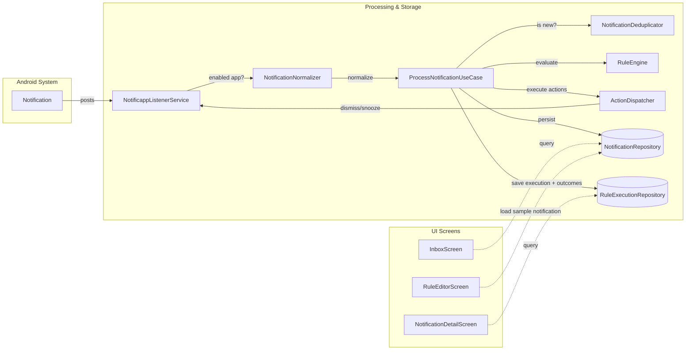

# Notificapp Architecture

## Overview

Notificapp is an open-source notification automation app for Android: users create rules that match notifications and trigger actions — dismiss, snooze, alerts, webhook delivery — entirely on-device.

Its flagship action is built around one core idea: **Notifications are often the only data interface an app exposes.** Extraction rules pull structured fields out of notification text and build a personal, local dataset — the capability that differentiates Notificapp from every other notification tool. See `docs/roadmap.md` for product positioning and phases.

### Key Principles

- **Local-first**
- **Rules created from real notifications**
- **Non-technical friendly UI**
- **Open and extensible extraction engine**

## Architecture Pattern: MVI (Model-View-Intent)

### What is MVI?

MVI stands for Model-View-Intent and provides unidirectional data flow:

- **Model**: Represents the state of the UI
- **View**: Displays the state and sends user intents
- **Intent**: Represents user actions or events

### Data Flow

```
User Action → Intent → ViewModel → State Update → UI Update
```

### Why MVI for Notificapp?

The MVI pattern is ideal for Notificapp's screens:

- **Inbox**: List of notifications with filtering/search state
- **Rule Editor**: Complex form state for extraction rule creation
- **Rules**: Manage user-defined extraction rules
- **Settings**: Configure app permissions and preferences
- **Data Browser** (planned, Roadmap Phase 3): Filterable, sortable list of extracted data

### Implementation Guidelines

1. **State Management**
    - Use `StateFlow` for UI state
    - Keep state immutable (use data classes with `copy()`)
    - Single source of truth for each screen state
    - Use sealed classes for representing different states (Loading, Success, Error)

2. **Intent Handling**
    - Define intents as sealed interface/class
    - Handle all intents in ViewModel
    - Process intents sequentially

3. **ViewModel Structure**
   ```kotlin
   class ExampleViewModel @Inject constructor(
       private val repository: Repository
   ) : MviViewModel<ExampleUiState, ExampleEvent, ExampleEffect>(ExampleUiState()) {
       
       override fun onEvent(event: ExampleEvent) {
           when (event) {
               is ExampleEvent.LoadData -> loadData()
               is ExampleEvent.UpdateData -> updateData(event.data)
           }
       }
   }
   ```

## Project Structure

### Current Structure (Monolithic)

Notificapp currently uses a **single-module (monolithic) structure** for rapid MVP development. The codebase is organized as **feature-first** with shared infrastructure in a `core/` package, designed to be easily extracted into separate modules when the project grows.

```
app/src/main/kotlin/dev/gaferneira/notificapp/
├── MainActivity.kt
├── core/
│   ├── common/                # Shared types (Failure.kt)
│   ├── data/                  # Data layer (persistence, Room, DataStore)
│   │   ├── local/             # AppDatabase, converters, DAOs, entities, mappers
│   │   ├── preferences/       # DataStore-backed user preferences
│   │   └── repository/        # Repository implementations (NotificationRepositoryImpl, 
│   │                          # RuleRepositoryImpl, SelectedAppRepositoryImpl, 
│   │                          # UserPreferencesRepositoryImpl)
│   ├── di/                    # Dependency injection modules (Hilt)
│   ├── extraction/            # Core extraction engine (pure Kotlin, no Android deps)
│   │   ├── RuleEngine         # Pure evaluate(notification, rules) -> List<RuleMatch>; no I/O
│   │   ├── RuleMatcher        # Pattern matching logic (pure Kotlin)
│   │   └── FieldExtractor     # Field extraction with patterns (pure Kotlin)
│   └── ui/                    # Shared UI layer
│       ├── mvi/               # Base MVI classes (MviViewModel, CollectOneOffEffects)
│       ├── navigation/        # Navigation (Screen, Routes, Navigator, NavigationHandler)
│       ├── theme/             # Material 3 theme
│       └── utils/             # UI utilities
├── domain/
│   ├── model/                 # Domain models (Notification, Rule, RuleExecution, AppInfo, 
│   │                          # SelectedApp, preferences, etc.)
│   └── repository/            # Repository interfaces (NotificationRepository, 
│                              # RuleRepository, SelectedAppRepository, 
│                              # UserPreferencesRepository)
├── features/                  # Feature screens (one package per screen/feature)
│   ├── appselection/          # App selection screen
│   ├── inbox/                 # Inbox screen - list of notifications
│   ├── notification/          # Notification system integration (NotificappListenerService,
│   │                          # RawNotificationReader - the Android-facing boundary)
│   ├── notificationdetail/    # Notification detail screen
│   ├── onboarding/            # Onboarding screen
│   ├── ruleeditor/            # Rule editor screen with UI components
│   ├── rules/                 # Rules management screen
│   └── settings/              # Settings screen
└── util/                      # Miscellaneous utilities
```

### Package Dependencies

```
features → domain (models + repository interfaces)
features → core/ui (MVI base, navigation)
features → core/* pure-Kotlin services (core/extraction's RuleEngine, core/rulesharing's RuleJsonCodec - Android-free, no core/data/domain.repository imports of their own)
core/data → domain (repository implementations)
core/extraction → domain (RuleEngine, RuleMatcher, FieldExtractor)
core/notification → core/extraction (notification processing)
```

**Rules:**
- Features depend on domain models, repository interfaces, core/ui, and pure-Kotlin `core/*` services (e.g. `RuleEditorViewModel` → `RuleEngine` for backtesting, `RulesViewModel` → `RuleJsonCodec` for import/export) — never on `core/data` (DAOs/entities) or Android-facing `core/notification` internals directly
- core/data implements domain repository interfaces
- core/extraction and core/rulesharing are pure Kotlin with no Android dependencies
- No circular dependencies between packages

### Future Modularization Path

When the project grows, packages can be extracted into modules:

```
:app                          # Main application
├── :core:model              # Domain models (pure Kotlin)
├── :core:data               # Data layer
├── :core:extraction         # Extraction engine (reusable, testable)
├── :core:notification       # Android notification APIs
├── :core:ui                 # MVI base, navigation, theme
├── :feature:inbox           # Inbox screen
├── :feature:ruleeditor      # Rule editor screen
├── :feature:rules           # Rules management screen
├── :feature:notificationdetail  # Notification detail screen
├── :feature:appselection    # App selection screen
├── :feature:onboarding      # Onboarding screen
└── :feature:settings        # Settings screen
```

This approach allows the extraction engine to be reused in other contexts (e.g., server-side processing, desktop apps) since it has no Android dependencies.

## Core Data Flow: Notification to Structured Event

The heart of Notificapp is the extraction pipeline that transforms raw notifications into structured data.

### Pipeline Overview



### Step-by-Step Flow

1. **Capture**: `NotificationListenerService` receives notification from Android system; filters (enabled app, has content, not system ongoing, not too old)
2. **Normalize**: `StatusBarNotification.toRawData()` reads the Android-specific fields into a plain `RawNotificationData`, then pure-Kotlin `NotificationNormalizer` transforms it into the domain `Notification` model
3. **Process**: the service delegates the normalized notification to `ProcessNotificationUseCase`, which owns the rest of the pipeline
4. **Deduplicate**: `NotificationDeduplicator` checks for duplicates (same content within time window)
5. **Persist**: `NotificationRepository` saves new notification to database
6. **Match & Extract**: `RuleEngine.evaluate(notification, rules)` (rules loaded via `RuleRepository`) returns pure `RuleMatch` results — `RuleMatcher` checks conditions, `FieldExtractor` extracts fields; no I/O in this step
7. **Execute Actions**: `ActionDispatcher` runs each matched rule's actions through the `ActionExecutor` registered for its `ActionType` (Hilt multibindings), recording a per-action `ActionOutcome` (`SUCCESS`/`FAILED`/`SKIPPED`). Dismiss/snooze reach the live listener via the narrow `SystemNotificationController` interface
8. **Save**: `ProcessNotificationUseCase` saves `RuleExecution` (with `actionOutcomes`) and `ExtractedFieldValue` rows via `RuleExecutionRepository`, transactionally
9. **Display**: UI screens query repositories to show notifications, rules, and execution results (including per-action outcome glyphs in Notification Detail)

### Design Rationale

**Separation of Concerns:**
- `features/notification` package handles Android-specific APIs only (`NotificappListenerService`, `RawNotificationReader`'s `StatusBarNotification.toRawData()`/`PackageManager.resolveAppName()`); `core/notification` holds `NotificationNormalizer`, `NotificationDeduplicator`, and pipeline orchestration (`ProcessNotificationUseCase`, `ActionDispatcher`, per-action `ActionExecutor`s), which is reused by `features/notificationdetail` and is pure Kotlin aside from the `SystemNotificationController` boundary
- `NotificationNormalizer` takes a plain `RawNotificationData` (no Android imports) and is unit-tested on the JVM; only the thin `RawNotificationReader` extension functions touch `StatusBarNotification`/`PackageManager` directly
- `core/extraction` contains `RuleEngine`, `RuleMatcher`, `FieldExtractor` — pure Kotlin, no Android or persistence dependencies
- `domain` models are the contract between layers

**Testability:**
- `RuleMatcher`, `FieldExtractor`, and `RuleEngine` are pure Kotlin with no Android dependencies — unit tested with mock data, no emulator
- `ProcessNotificationUseCase` and `ActionDispatcher` are unit tested with fake repositories/executors
- Rules can be tested against historical notification data without emulator (enables future backtesting)
- Action execution behind the `ActionExecutor` interface allows testing without system dependencies

## Tech Stack

### UI Layer

- **Jetpack Compose**: Declarative UI framework
- **Material 3**: Design system and components
- **Navigation3** (`androidx.navigation3`): Type-safe navigation with custom Navigator (see ADR 007 and "Navigation" section below)
- **Accompanist**: System UI controller, permissions

### Architecture Components

- **ViewModel**: Lifecycle-aware state management
- **Lifecycle**: Lifecycle-aware components
- **StateFlow/Flow**: Reactive data streams
- **DataStore**: Preferences (notification access settings, selected apps)

### Dependency Injection

- **Hilt**: Dependency injection framework
- Constructor injection throughout
- Appropriate scoping: `@Singleton`, `@ViewModelScoped`

### Data Layer

- **Room**: Local database for notifications and events
- **Kotlin Serialization**: JSON for rule definitions and export

### Asynchronous Programming

- **Kotlin Coroutines**: Asynchronous programming
- **Flow**: Reactive streams for real-time notification updates
- **Dispatchers**: IO, Main, Default (always inject for testability)

### Testing

- **JUnit 5**: Testing framework
- **Kotest**: Assertions and matchers
- **MockK**: Mocking framework
- **Turbine**: Flow testing

*Note: 88 tests currently run against these frameworks, covering the extraction engine, `ProcessNotificationUseCase`, and action executors; ViewModel and repository tests are still pending.*

### Other

- **Timber**: Logging
- **Spotless**: Code formatting

## Clean Architecture Layers

### 1. Presentation Layer (`features/` + `core/ui`)

**Responsibilities:**

- Display UI using Jetpack Compose
- Handle user interactions (create rule, test rule, filter notifications, etc.)
- Observe ViewModel state
- Navigate between screens

**Components:**

- Composable functions organized by feature (AppSelectionScreen, InboxScreen, RuleEditorScreen, RulesScreen, NotificationDetailScreen, OnboardingScreen, SettingsScreen)
- ViewModels (AppSelectionViewModel, InboxViewModel, RuleEditorViewModel, RulesViewModel, NotificationDetailViewModel, OnboardingViewModel, SettingsViewModel)
- UI state classes and contracts (UiState, UiEvent, UiEffect per screen)
- Base MVI classes in `core/ui/mvi` (MviViewModel, CollectOneOffEffects)
- Navigation infrastructure in `core/ui/navigation` (Screen, Routes, Navigator, NavigationHandler)

**Rules:**

- No business logic
- No direct data access - only through repositories
- Observe state via StateFlow
- Send intents to ViewModel

### 2. Domain Layer (`domain` package)

**Responsibilities:**

- Define core business concepts
- Repository interfaces (contracts)
- Domain models

**Key Domain Models:**

```kotlin
// Captured notification, normalized from Android's StatusBarNotification
data class Notification(
    val id: String,
    val packageName: String,
    val appName: String,
    val title: String?,
    val content: String?,
    val rawContent: String,
    val timestamp: Long,
    val isProcessed: Boolean = false,
    val appliedRulesCount: Int = 0,
    val sbnKey: String? = null,
)

// User-defined extraction rule
@Serializable
data class Rule(
    val id: String,
    val name: String,
    val description: String?,
    val category: String? = null,
    val isActive: Boolean = true,
    val targetApps: List<AppInfo>? = null, // null = applies to all apps
    val conditions: List<RuleCondition> = emptyList(),
    val fields: List<RuleField> = emptyList(),
    val actions: List<RuleAction> = emptyList(),
    val createdAt: Long = System.currentTimeMillis(),
    val updatedAt: Long = System.currentTimeMillis(),
)

// One record per rule match against a notification
data class RuleExecution(
    val id: String,
    val notificationId: String,
    val ruleId: String,
    val extractedData: Map<String, String>,
    val triggeredActions: List<String>,
    val triggeredRuleActions: List<RuleAction> = emptyList(),
    val actionOutcomes: Map<String, ActionOutcome> = emptyMap(), // actionId -> SUCCESS/FAILED/SKIPPED
    val createdAt: Long = System.currentTimeMillis(),
)

// Typed extracted value (one row per field per execution), used for filtering
data class ExtractedFieldValue(
    val id: String,
    val ruleExecutionId: String,
    val ruleFieldId: String,
    val valueText: String?,
    val valueNumber: Double?,
    val valueDate: Long?,
)
```

**Rules:**

- Platform-independent (pure Kotlin)
- No Android framework dependencies
- Immutable data classes

### 3. Data Layer (`core/data`)

**Responsibilities:**

- Data persistence
- Repository implementations
- Database access
- User preferences storage

**Components:**

- Repositories (NotificationRepository, RuleRepository, SelectedAppRepository, UserPreferencesRepository, RuleExecutionRepository — the last one wraps `RuleExecutionDao`/`ExtractedFieldValueDao`/`NotificationDao` writes in a single transaction)
- Room database with 9 entities (NotificationEntity, RuleEntity, RuleConditionEntity, RuleFieldEntity, RuleActionEntity, RuleTargetAppEntity, RuleExecutionEntity, ExtractedFieldValueEntity, SelectedAppEntity)
- DAOs for each entity
- Mappers from entities to domain models
- DataStore for user preferences (notification access settings, selected apps)

**Rules:**

- Implement repository interfaces defined in domain layer
- Map database entities to domain models
- Handle errors gracefully by returning `Result<T>` or sealed `DataResult`
- Provide reactive streams (Flow)

### 4. Extraction Layer (`core/extraction`)

**Responsibilities:**

- Match notifications against rules
- Extract structured fields from text
- Orchestrate rule processing

**Components:**

- `RuleMatcher`: Checks if a notification matches rule conditions (pure Kotlin)
- `FieldExtractor`: Extracts specific fields using patterns (regex, templates) (pure Kotlin)
- `RuleEngine`: Pure `evaluate(notification, rules): List<RuleMatch>` — matches conditions and extracts fields with no persistence or I/O

**Rules:**

- `RuleMatcher`, `FieldExtractor`, and `RuleEngine` are pure Kotlin with no Android dependencies and zero `core.data`/`domain.repository` imports
- Fully unit testable without emulator
- Extensible design for new extraction methods

**Design Notes:**

- Rule loading (via `RuleRepository`) and persistence (via `RuleExecutionRepository`) live in `core/notification/ProcessNotificationUseCase`, not in `core/extraction` — this keeps `core/extraction → domain` as the only dependency direction
- `RuleMatch` (`domain/model/RuleMatch.kt`) is the pure evaluation result returned by `RuleEngine`, before it is converted into a persisted `RuleExecution`
- **Notification normalization** (`NotificationNormalizer`) lives in `core/notification/`, not extraction — it's pure Kotlin (takes `RawNotificationData`, no Android imports; TD-14). Only the thin `RawNotificationReader` extension functions in `features/notification/` touch `StatusBarNotification`/`PackageManager`. `NotificationDeduplicator` is also pure Kotlin and lives in `core/notification/` with `ProcessNotificationUseCase`

## Coding Standards

### Kotlin

- Use Kotlin idioms and best practices
- Prefer immutability (`val` over `var`)
- Use data classes for models
- Use sealed classes for state/events
- Use extension functions
- Avoid `!!` operator - use safe calls (`?.`) and elvis operator (`?:`)
- Use meaningful variable and function names
- Keep functions small and focused

### Jetpack Compose

- Keep Composables pure when possible
- Use `remember` and `rememberSaveable` appropriately
- Use `LaunchedEffect` for side effects
- Use `derivedStateOf` for computed state
- Avoid unnecessary recompositions
- Use `collectAsStateWithLifecycle()` to observe flows safely
- Use the **Modifier Pattern**: Accept `modifier: Modifier = Modifier` as the first optional parameter
- Use `@Preview` for both Light and Dark modes
- Follow Material 3 guidelines
- Use theme colors, typography, and spacing
- Implement accessibility (content descriptions)

### State Management

- Use `StateFlow` for UI state in ViewModels
- Use `Channel` or `SharedFlow` for one-time events (e.g., "Rule saved")
- Never expose mutable state directly
- Update state immutably using `copy()`
- Handle loading, success, and error states

### Error Handling

- Use try-catch blocks in ViewModels and repositories
- Log errors using Timber
- Show user-friendly error messages
- Handle edge cases (empty notifications, malformed rules)
- Graceful degradation when extraction fails

### Testing

**Test Standards (Required):**

- Unit tests for extraction engine (RuleMatcher, FieldExtractor, RuleEngine)
- Unit tests for ViewModels and state management
- Unit tests for repositories and data mapping
- Test all MVI components (Model state transitions, Intent handling, Effects)
- Test rule matching with various notification formats
- Use Given-When-Then (arrange-act-assert) pattern
- Mock external dependencies with MockK
- Use descriptive test names
- Framework: JUnit 5, assertions via Kotest, Flow testing via Turbine

**Avoiding `runTest` hangs with infinite collectors:** some ViewModels launch a never-completing `collect {}` coroutine in `init`/at construction on `viewModelScope` (e.g. observing a settings or filter `Flow` for the lifetime of the VM). A naive `runTest { }` around one of these will report *"the test coroutine is not completing, there were active child jobs"* or hang outright, because `advanceUntilIdle()` never drains a hot `collect`. Standardize on: construct the VM inside the test body, drive it with `advanceUntilIdle()`, then read `uiState.value` synchronously — the collector updates state eagerly on the injected `StandardTestDispatcher`, so there's no need to keep a Turbine `viewModel.uiState.test { }` block open across it. If you do use Turbine for effects on such a VM, close the block with `cancelAndIgnoreRemainingEvents()` rather than letting it complete naturally. Backing flows should come from a Fake repository that emits a fixed number of items and then idles, not a real Flow that never completes on its own.

**Current Status:**

- 229 passing tests in `app/src/test`: `RuleMatcherTest` (all 6 operators), `FieldExtractorTest` (all 10 extraction methods), `RuleEngineTest`, `ProcessNotificationUseCaseTest`, `ActionDispatcherTest`, per-executor tests, `NotificationNormalizerTest`, `RuleJsonCodecTest`/`RuleJsonCodecGoldenFileTest`, and four ViewModel test suites, with shared fixtures in `testutil/TestFixtures.kt`
- `useJUnitPlatform()` wired in `app/build.gradle.kts`; `./gradlew test` is a real, meaningful gate
- ViewModel and repository tests are still pending

### Dependency Injection

- Use constructor injection
- Provide dependencies through Hilt modules
- Use appropriate scopes
- Keep modules organized by feature/layer

### Navigation

We use Navigation3 (AndroidX Navigation 3.x) with a custom architecture for type-safe navigation:

- **Type-safe routes**: Sealed class `Screen` with `@Serializable` routes
- **NavDisplay**: Compose component for rendering the current destination
- **entryProvider**: DSL for mapping routes to composables
- **NavigationHandler**: Singleton for ViewModel-driven navigation via SharedFlow
- **Internal effect handling**: Screens handle sub-flows (bottom sheets) internally
- **Specific callbacks**: Only expose named callbacks when parent coordination needed

**Key Components:**

| Component | Purpose |
|-----------|---------|
| `Screen` | Sealed class with serializable routes |
| `Routes` | Factory object for creating routes |
| `Navigator` | Wraps NavigationState for back stack manipulation |
| `NavOptions` | Builder for navigation options (clearStack, popUpTo, launchSingleTop) |
| `NavigationHandler` | ViewModel navigation via SharedFlow |
| `MainBottomNav` | Bottom navigation component |

**Example - Screen with internal bottom sheet:**

```kotlin
@Composable
fun RuleEditorScreen(onBackClicked: () -> Unit) {
    val addFieldSheetState = rememberAddFieldSheetState()
    
    // Handle ViewModel effects
    CollectOneOffEffects(viewModel.effect) { effect ->
        when (effect) {
            is UiEffect.NavigateBack -> onBackClicked()
            is UiEffect.ShowAddFieldSheet -> addFieldSheetState.show()
        }
    }
    
    // Bottom sheet handled internally
    AddFieldBottomSheet(
        isVisible = addFieldSheetState.isVisible,
        onDismiss = { addFieldSheetState.hide() },
        onFieldAdded = { field ->
            viewModel.onEvent(UiEvent.OnFieldAdded(field))
            addFieldSheetState.hide()
        }
    )
}
```

**Example - Specific callbacks (not generic onNavigate):**

```kotlin
// Good
fun RuleEditorScreen(
    onBackClicked: () -> Unit,
    onShowSuccess: (message: String) -> Unit,
)

// Avoid
fun RuleEditorScreen(
    onNavigate: (UiEffect) -> Unit,  // Too generic
)
```

**Example - ViewModel navigation via NavigationHandler:**

```kotlin
@HiltViewModel
class MyViewModel @Inject constructor(
    private val navigationHandler: NavigationHandler
) : ViewModel() {
    fun onItemClick(id: String) {
        viewModelScope.launch {
            navigationHandler.navigate(Routes.notificationDetails(id))
        }
    }
}
```

**Reference:** ADR 007 – Navigation3 with Custom Navigator

### Resources

- No hardcoded strings - use string resources
- No hardcoded dimensions - use theme spacing
- Support dark theme
- Use vector drawables

### Git

- Write meaningful commit messages
- Keep commits atomic and focused
- Format code with Spotless before committing

## Security & Privacy

### Local-First Design

- All notification data stored locally on device
- No cloud sync in initial version
- User has full control over which apps are monitored

### Data Protection

- Database can be encrypted if needed (SQLCipher)
- No analytics or telemetry without explicit opt-in
- Clear data export for user portability

### Permissions

- Request `BIND_NOTIFICATION_LISTENER_SERVICE` permission clearly
- Explain why notification access is needed
- Allow users to revoke access at any time

## Performance

- **Efficient database queries**: Index on frequently queried fields (timestamp, package name)
- **Lazy loading**: Paginate inbox and event lists
- **Coroutines**: Efficient async operations
- **Flow**: Reactive updates without polling

## Accessibility

- Content descriptions for all interactive elements
- Semantic properties for Compose components
- Support for TalkBack
- Proper text contrast ratios
- Touch target sizes (min 48dp)

## Best Practices Summary

1. **Follow MVI pattern strictly** - Unidirectional data flow
2. **Keep extraction engine pure** - No Android dependencies for testability
3. **Use Hilt everywhere** - Consistent dependency injection
4. **Write tests** - Unit tests for extraction logic and ViewModels
5. **Use Compose** - Modern declarative UI
6. **Handle errors gracefully** - User-friendly messages
7. **Log appropriately** - Use Timber for debugging
8. **Format code** - Run Spotless before commits
9. **Document public APIs** - Use KDoc comments
10. **Respect user privacy** - Local-first, no unnecessary data collection

## Architecture References

Key architectural decisions are documented as Architecture Decision Records. The canonical, always-current index — with statuses and conventions for adding new ones — lives at **[`docs/adr/README.md`](adr/README.md)**. Decisions referenced throughout this document (ADR 001–012) are all listed there.

## Resources

- [Now in Android](https://github.com/android/nowinandroid) - Architecture inspiration
- [Jetpack Compose](https://developer.android.com/jetpack/compose)
- [MVI Architecture](https://hannesdorfmann.com/android/model-view-intent/)
- [Android Clean Architecture](https://developer.android.com/topic/architecture)
- [NotificationListenerService](https://developer.android.com/reference/android/service/notification/NotificationListenerService)
